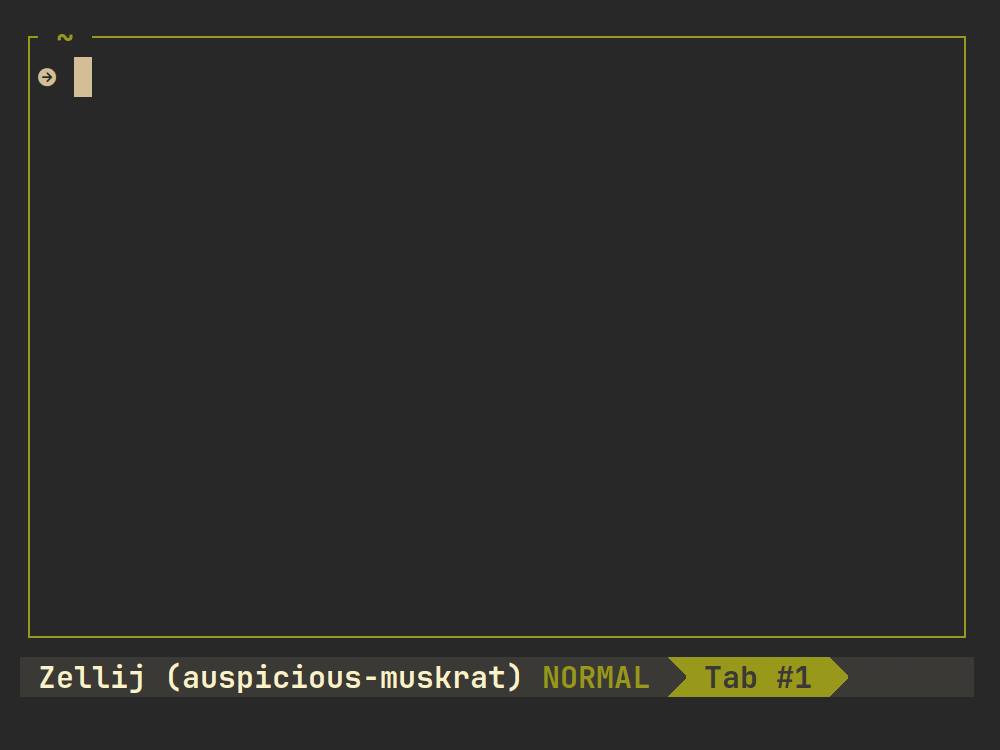

# Exercism Download Helper (aka) `exer-h`
This project is a small wrapper for the official **Exercism CLI**



### Note
Tested to work in linux env (Ubuntu & Termux)

## Prerequisites
- Official [`Exercism CLI`](https://exercism.org/docs/using/solving-exercises/working-locally)
- [`Nodejs` and `npm`](https://nodejs.org/en/download/package-manager)

## Install
```shell
npm i exer-h -g
```

## Running the project
Run the script anywhere in the terminal with:
```shell
exer-h
```


